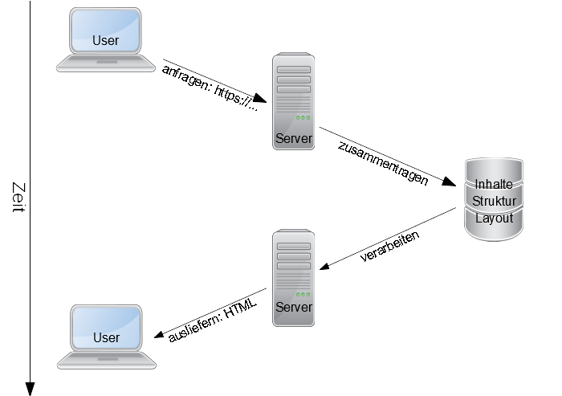

## Warum GitHub Pages?

- **Kostenloser Webspace:** Pages ist kostenlos nutzbar für öffentliche Repositories.
- **Niedrigschwellig:** Wenige Webkenntnisse reichen für eine einfache Seite aus.
- **Flexibilität:** Von der einfachen HTML-Seite bis zu komplexen Auftritten mithilfe mächtiger Tools.
- **Versionierung und Transparenz:** Historie der zugrunde liegenden Dateien wird über Git verwaltet und ist für alle(!) einsehbar.
- **Kollaboration:** Die bekannten Funktionen von Git und GitHub zur Zusammenarbeit und Rollenmanagement können nachgenutzt werden.

**Achtung:** Der Inhalt sollte sich nicht häufig ändern, also eher *statisch* sein.

## Statische und dynamische Webseiten

GitHub Pages ist für statische Webseiten gedacht (im Gegensatz zu [dynamischen Webseiten](https://de.wikipedia.org/wiki/Webseite#Dynamische_Webseiten)).

Ausliefern dynamischer Webseiten:  

Ausliefern statischer Webseiten:  

GitHub Pages stellt standardmäßig das Werkzeug [Jekyll](https://jekyllrb.com/) als [Static Site Generator](https://en.wikipedia.org/wiki/Static_site_generator) bereit.

Es kann aber auf die volle Mächtigkeit von Actions zurückgegriffen werden.

## Alternativen

- Social Media
- Blogging-Dienst 
- Content-Management-System (-Hoster)
- (alles selber hosten)
