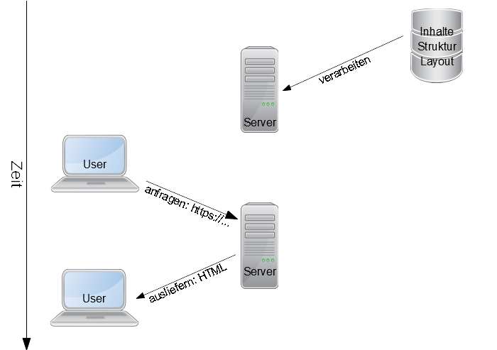

## Statische und dynamische Webseiten

GitHub Pages ist für statische Webseiten gedacht, im Gegensatz zu [dynamischen Webseiten](https://de.wikipedia.org/wiki/Webseite#Dynamische_Webseiten).
Beide Typen haben ihre [Vor- und Nachteile](https://about.gitlab.com/blog/2016/06/03/ssg-overview-gitlab-pages-part-1-dynamic-x-static/).

### Ausliefern dynamischer Webseiten

### Ausliefern statischer Webseiten

### Generieren von statischen Webseiten

GitHub Pages stellt standardmäßig das Werkzeug [Jekyll](https://jekyllrb.com/) als [Static Site Generator](https://en.wikipedia.org/wiki/Static_site_generator) bereit.
Jekyll nimmt einfache Textdateien (Markdown) entgegen und generiert daraus HTML-Seiten mithilfe von Struktur- und Layout-Vorlagen.
Man kann auf eine Reihe [vordefinierter Vorlagen](https://pages.github.com/themes/) zurückgreifen oder diese selbst abändern.

Es kann auch auf die volle Mächtigkeit von GitHub Actions zurückgegriffen werden oder einfach händisch erstellte HTML-Dateien ausgeliefert werden.

